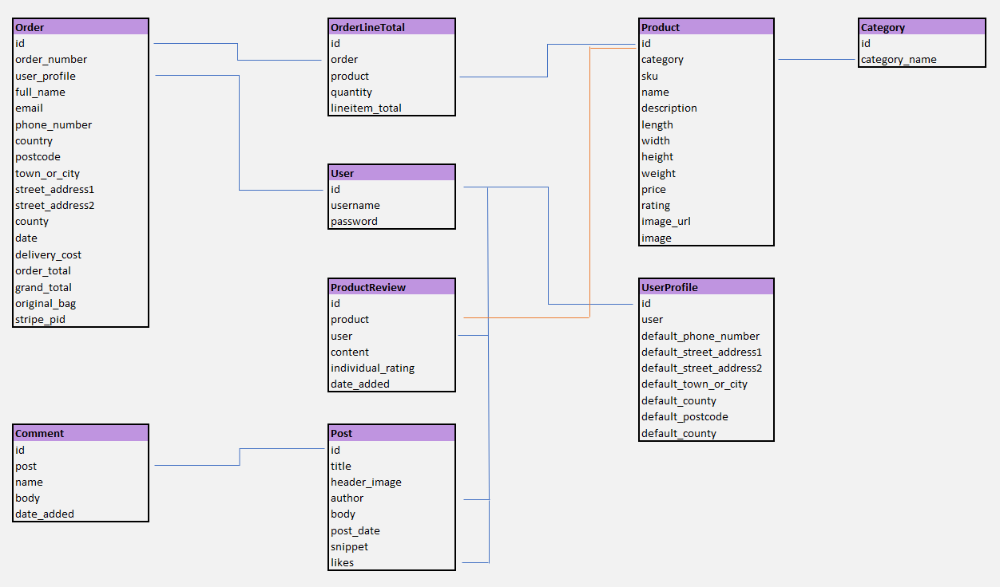
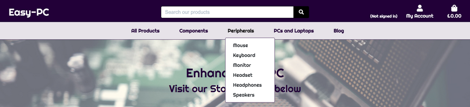
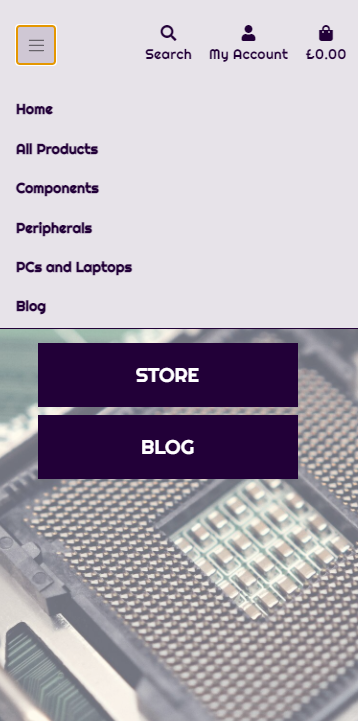
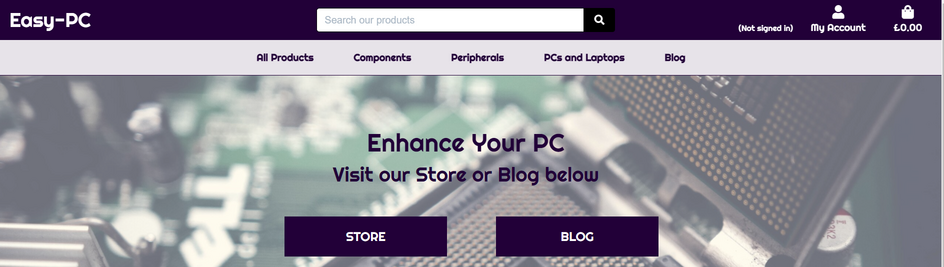

# [Easy-PC](https://easy-pc-jw.herokuapp.com/)
## Milestone Project 4
## E-Commerce Web App - PC, Parts and Equipment

Easy-PC is an e-commerce web application. 
The main target audience of the site include computing enthusiasts, gamers and content creators. A powerful computer is essential for high quality gaming and content creation. An upgrade made to your PC is never a bad thing!

The site offers computer parts such as graphics cards, processors, monitors, keyboards and all sorts of components and peripherals for your computing needs.

There is also a blog where posts are published by staff members/admininstrators, where they will share their thoughts and experiences on fully built PCs or specific components, or just anything computer related. If an article covers a certain component that a reader is looking to purchase, the article will provide a personal insight. The main idea here is to provide the reader a better perspective on the specific product.

Disclaimer(Important): The site contains real life products. Please visit sites mentioned in the credits section if you wish to purchase them.

The live website can be found [here](https://easy-pc-jw.herokuapp.com/).

### Testing transactions

If you would like make a test purchase, please use the below details:

- Credit Card: 4242 4242 4242 4242
- Expiration Date: 04 / 24
- CVC: 424
- ZIP: 42424

# User Experience (UX)

## User Stories
- As a Visitor and a Potential Customer of the site:

    - I would like to navigate the website without registering or signing up.
    - I would like to register for an account
    - I would like to browse products and sort them by either name, rating or price.
    - I would like to search for a product.
    - I would like to read reviews of a product or comments on a blog article.
    - I would like to leave a comment on a blog post even without having an account.
    - I would like to purchase an item and checkout easily.
    - I would like to edit my shopping bag easily.
    - I would like to to receive confirmation of my order.
    - I would like to register an account.

- As a Registered User of the site:

    - I would like to save my details to my profile.
    - I would like to view my order history.
    - I would like to review a product.
    - I would like to comment on a blog post.

- As an Administrative User:

    - I would like to add a new product to the database.
    - I would like to edit existing product details.
    - I would like to create new blog posts.
    - I would like to edit an existing blog post.
    - I would like to delete existing reviews written by all users in case the content is inappropriate.

# Design

## Colour Scheme

- The colour scheme for the project is Purple, White and Black. The purple theme gives a feeling of gaming desktop, in particular with the trend and use of RGB lighting.
- The headings, main navigation bar and headers are a deep purple colour. Some buttons are black with a purple on hover effect.
- The text was kept as black for easy reading.
 
## Typography

- The font-family used for headings and logo is 'Righteous'. Again this gave a gaming feel to it.
- The general body text fonr used is 'Sans-Serif'. This was chosen due to it's simplicity and readability. This is important especially for purchasing reasons.

# Wireframes

 - The initial designs or Wireframes were created using Balsamiq. This can be found [here]().

 # Database Models and Schema

 ## Models

 ### Users

 - User - from Django Allauth, this contains the username, email and password and also used for authentication purposes.

 - UserProfile - Model containing the user's details for future orders.

 ### Products

 - Product - This contains the information for each product.

 - Category - The categories for the products.

 - Product Reviews - These house the reviews for each products with comments and ratings.

 ### Store

 - Order - This contains the details of customer orders.

 - Orderline Item - This contains the customer order, quantities and order totals.

 ### Blog

 - Post - This contains the blog posts that will show the author, title and date posted. This also houses the amount of Likes a post has received.

 - Comments - This contains the comments for each post.

 ### Database Diagram
 - The diagram below shows the database relationship.

 

# Features

## Navigation Bar and Footer

- The navigation bar is fixed at the top of the page for easy navigation. This includes links to direct the user to the homepage, account, sign-in, register and shopping bag pages. There is also a search bar for the user to search for products.
- The navigation bar will also let the user know if they are signed in or not.
- The Sub navigation bar houses the product types and Blog page. Each product type has a drop-down menu for sub categories such as for PC components, this houses links to graphics cards, processors and storage etc.

- The footer houses social media links and also the company email address and contact number.

- On small devices, the main navigation will be compressed into a slide menu which can be opened using the menu icon.

## Homepage
 - There are two buttons on the homepage which will redirect the user to either the STORE or the BLOG pages.

## Login Page

- a simple login page for registered users to sign in. If the user has been validated, a toast message is displayed and will redirect the user to the Homepage. If either the username or password is incorrect, the toast message will display an error to inform the user. If a user has forgotten their password, they can request for an email in order to reset their password.

## Registration Page

- Non-user will have to input a valid username, email address and password on the form. The submit button will send their infromation to the Database. The user will be sent an email for verification. 

## Profile Page

- Users can check or update their delivery information and view their order history, if any.

## Products Page

- Display products using Bootstrap cards along with the associated image of the products. By clicking the picture or product's name the user will be redirected to the product detail page. On Clicking the "sort by .." dropdown button, the user will be able to display all the products for their desired sorting (price, name, rating or category). At the bottom right of the screen is a Back to Top button. If the user is a SuperUser, Edit/Delete button will be displayed to allow easy Product Management.

## Credits

 - [amazon](amazon.co.uk) - All of the products listed are takn from amazon.

 - For the articles, these were taken from [PC Gamer](https://www.pcgamer.com/uk/) and [Tech Reviews](https://www.techradar.com/reviews). They have excellent content reltated to computing and gaming.

