# [Easy-PC](https://easy-pc-jw.herokuapp.com/)

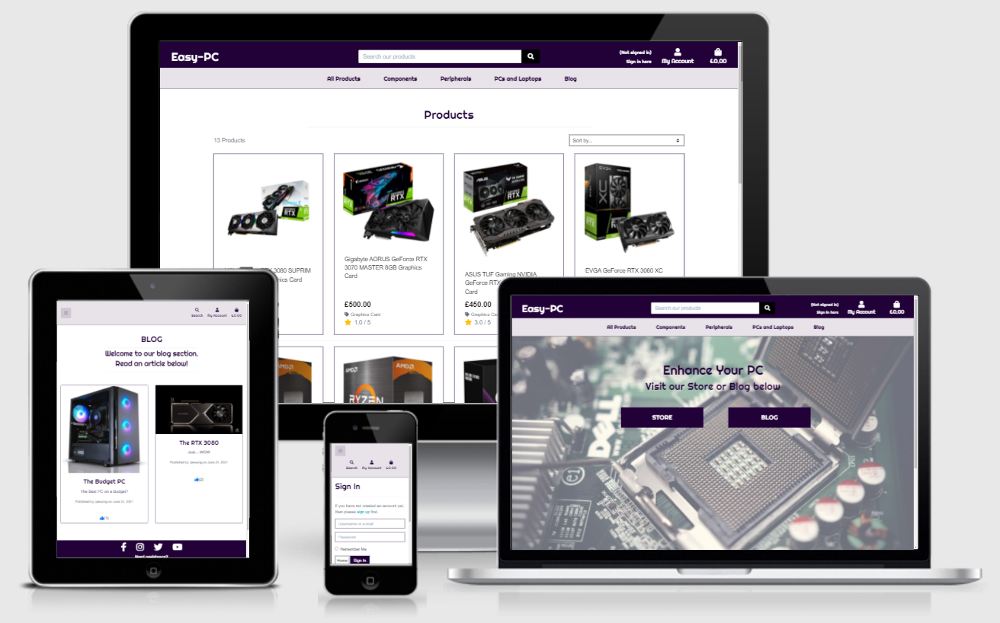

## Milestone Project 4
## E-Commerce Web App - PC, Parts and Equipment

Easy-PC is an e-commerce web application. 
The main target audience of the site include computing enthusiasts, gamers and content creators. A powerful computer is essential for high quality gaming and content creation. An upgrade made to your PC is never a bad thing!

The site offers computer parts such as graphics cards, processors, monitors, keyboards and all sorts of components and peripherals for your computing needs.

There is also a blog where posts are published by staff members/admininstrators, where they will share their thoughts and experiences on fully built PCs or specific components, or just anything computer related. If an article covers a certain component that a reader is looking to purchase, the article will provide a personal insight. The main idea here is to provide the reader a better perspective on the specific product.

Disclaimer(Important): The site contains real life products. Please visit sites mentioned in the credits section if you wish to purchase them.

The live website can be found [here](https://easy-pc-jw.herokuapp.com/).

### Testing transactions

If you would like make a test purchase, please use the below details:

- Credit Card: 4242 4242 4242 4242
- Expiration Date: 04 / 24
- CVC: 424
- ZIP: 42424


# User Experience (UX)

## User Stories
- As a Visitor and a Potential Customer of the site:

    - I would like to navigate the website without registering or signing up.
    - I would like to register for an account
    - I would like to browse products and sort them by either name, rating or price.
    - I would like to search for a product.
    - I would like to read reviews of a product or comments on a blog article.
    - I would like to leave a comment on a blog post even without having an account.
    - I would like to purchase an item and checkout easily.
    - I would like to edit my shopping bag easily.
    - I would like to to receive confirmation of my order.
    - I would like to register an account.

- As a Registered User of the site:

    - I would like to save my details to my profile.
    - I would like to view my order history.
    - I would like to review a product.
    - I would like to comment on a blog post.
    - I would like to "Like" a Blog Article.

- As an Administrative User:

    - I would like to add a new product to the database.
    - I would like to delete an existing product.
    - I would like to edit existing product details.
    - I would like to create new blog posts.
    - I would like to edit an existing blog post.
    - I would like to delete an existing blog post.
    - I would like to delete existing reviews written by all users in case the content is inappropriate.
    - I would like to remove existing Blog Article comments by all users or visitors, in case the content is inappropriate.


# Design

## Colour Scheme

- The colour scheme for the project is Purple, White and Black. The purple theme gives a feeling of gaming desktop, in particular with the trend and use of RGB lighting.
- The headings, main navigation bar and headers are a deep purple colour. Some buttons are black with a purple on hover effect.
- The text was kept as black for easy reading.
 
## Typography

- The font-family used for headings and logo is 'Righteous'. Again this gave a gaming feel to it.
- The general body text fonr used is 'Sans-Serif'. This was chosen due to it's simplicity and readability. This is important especially for purchasing reasons.

# Wireframes

 - The initial designs or Wireframes were created using Balsamiq. This can be found [here](readme-images/MS4-Easy-PC-wireframes.pdf).

 # Database Models and Schema

 ## Models

 ### Users

 - User - from Django Allauth, this contains the username, email and password and also used for authentication purposes.

 - UserProfile - Model containing the user's details for future orders.

 ### Products

 - Product - This contains the information for each product.

 - Category - The categories for the products.

 - Product Reviews - These house the reviews for each products with comments and ratings.

 ### Store

 - Order - This contains the details of customer orders.

 - Orderline Item - This contains the customer order, quantities and order totals.

 ### Blog

 - Post - This contains the blog posts that will show the author, title and date posted. This also houses the amount of Likes a post has received.

 - Comments - This contains the comments for each post.

 ### Database Diagram
 - The diagram below shows the database relationship.


 

# Features

## Navigation Bar and Footer

- The navigation bar is fixed at the top of the page for easy navigation. This includes links to direct the user to the homepage, account, sign-in, register and shopping bag pages. There is also a search bar for the user to search for products.
- The navigation bar will also let the user know if they are signed in or not.
- The Sub navigation bar houses the product types and Blog page. Each product type has a drop-down menu for sub categories such as for PC components, this houses links to graphics cards, processors and storage etc.


- The footer houses social media links and also the company email address and contact number.


- On small devices, the main navigation will be compressed into a slide menu which can be opened using the menu icon.


## Homepage
 - There are two buttons on the homepage which will redirect the user to either the STORE or the BLOG pages.


## Login Page

- a simple login page for registered users to sign in. If the user has been validated, a toast message is displayed and will redirect the user to the Homepage. If either the username or password is incorrect, the toast message will display an error to inform the user. If a user has forgotten their password, they can request for an email in order to reset their password.

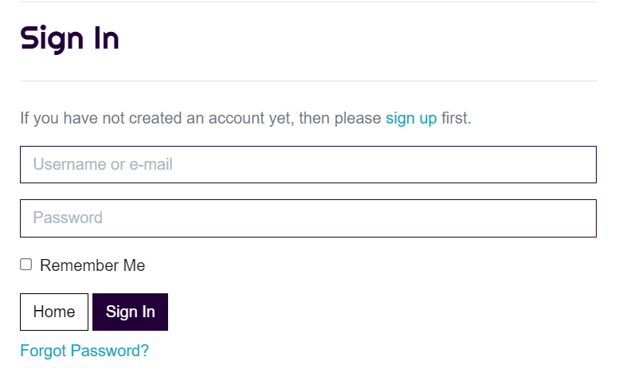

## Registration Page

- Non-user will have to input a valid username, email address and password on the form. The submit button will send their infromation to the Database. The user will be sent an email for verification. 

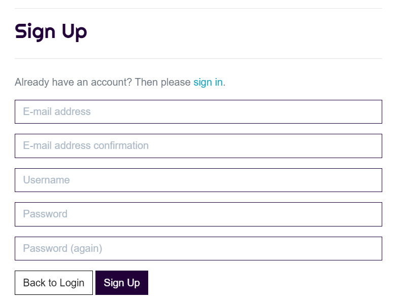

## Profile Page

- Users can check or update their delivery information and view their order history, if any.

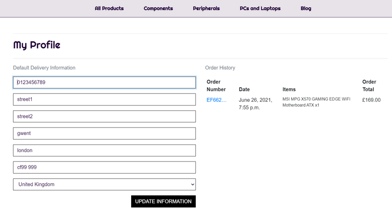

## Products Page

- Display products using Bootstrap cards along with the associated image of the products, price, category and rating. By clicking the picture or product's name the user will be redirected to the product detail page. On Clicking the "sort by .." dropdown button, the user will be able to display all the products for their desired sorting (price, name, rating or category). At the bottom right of the screen is a Back to Top button. If the user is a SuperUser, Edit/Delete button will be displayed to allow easy Product Management.

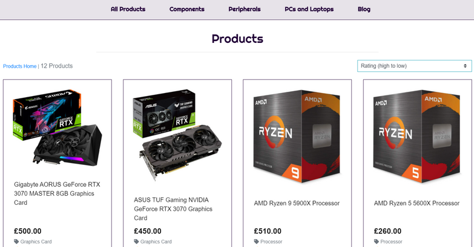


## Product Search Function

- The search bar at the top of every page on the site will allow the visitor to submit search queries to find a product. Once a query is submmited, the page will display products which contains the searched term and display how many products were found.

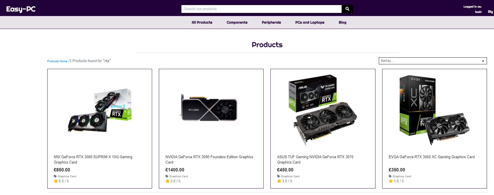


## Product Detail Page

- In the detail page, to the left, the associated image of the product is displayed. To the right the title, description, product dimensions and weight. Plus/Minus icons are placed either side of Number Input Field to increase and decrease quantity. Two buttons - 'Add to Bag' and 'Keep Shopping' - are placed below the quantity input field. The Keep Shopping button will returns the user to the All product page. The add to bag button will add the item(s) to the cart. A toast message will advise the user that their item is added to the bag. If the total is below £75, an additional message will let the user know how much they would need to spend to qualify for free delivery. The bottom of this page will house the reviews, if any are submitted.

- Only registered and valid users are able to write a review for a product. The average rating for each product will be updated everytime a review is added. A user is limited to one review per product where there is a sentence to notify the user has already placed a review.


## Bag Page

- This page will display the items the user has currently added into their shopping bag. They will be able to adjust the quantity of the products and view the totals and subtotals. The "Secure Checkout" button will redirect the user to the checkout page. The "Keep Shopping" button will return the user to the products page.

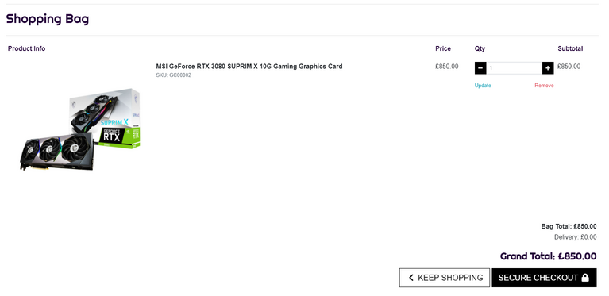

## Checkout Page

- After the user finalizes their purchase, they can move ahead to do a checkout and make the payment of the purchase. This page is divided into two parts, on the right shows the order summary, on the left shows a form requesting for information about the user. The user must fill in the form on the left before being able to continue the checkout process. There are required fields in the form and this information will be saved to the DB and can be checked in the user profile page if the user has logged in or created an account prior to checkout. The credit card field is linked to STRIPE and the form inherits the stripe validations associated with credit cards. Buttons at the bottom allow the user to go back to the shopping cart and make adjustments to the quantity purchased or move ahead to pay and complete the order. Once the user submits the payment information a purple loading screen appears to show that the payment is being processed.

If you would like make a test purchase, please use the below details:

- Credit Card: 4242 4242 4242 4242
- Expiration Date: 04 / 24
- CVC: 424
- ZIP: 42424

Please note that due to Stripe restrictions, single orders that exceed £10,000 are not permitted. Defensive measures on the website is in place to notify if a customer holds items in their shopping bag that exceed this.

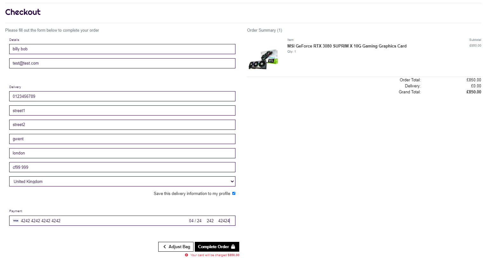

## Checkout Success / Order Confirmation Page

- The order confirmation page lists out the order number and the detail of the purchase along with the subtotal and grandtotal. User can check for their order in the profile page. The user can browse back to the products page by clicking the "Browse more lashes" button below the form. The user will also be sent a confirmation email for reference.

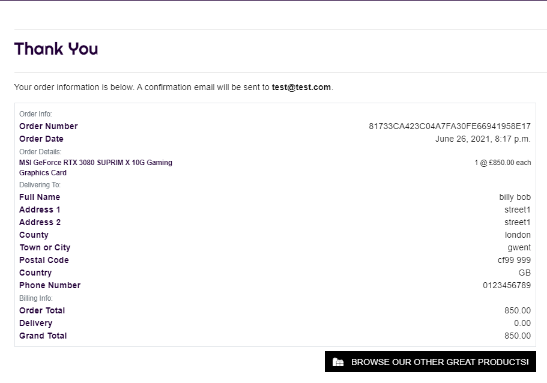


## Blog page

- The blog posts will be available for all users to read. Only the SuperUser is able to add new blog posts. Each blog article on this page are stylised using bootstrap card elements, with their associated header images resized at the top of each card. The title and subheadings are placed under the image, along with the author and date published. There is also a thumbs-up icon where the number in brackets show how many liked the the article has received.

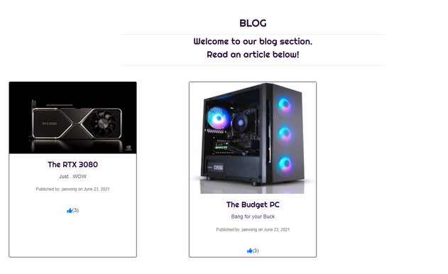


## Article page

- This will show the whole article with the main image above. The text is stylised using django's own integrated 'django-ckeditor'. This will allow the author to format the article as they see fit. There is a like button where only validated users can click. This will add a like and only one like is permissable per user. The button is interactive where as a user can change their mind and dislike the article, where the button will become a thumbs-down. Toast messages will notify the user of their like or dislike.

- The bottom of the article page is the comment section. Any visitor of the site, registered or not, are able to leave a comment.

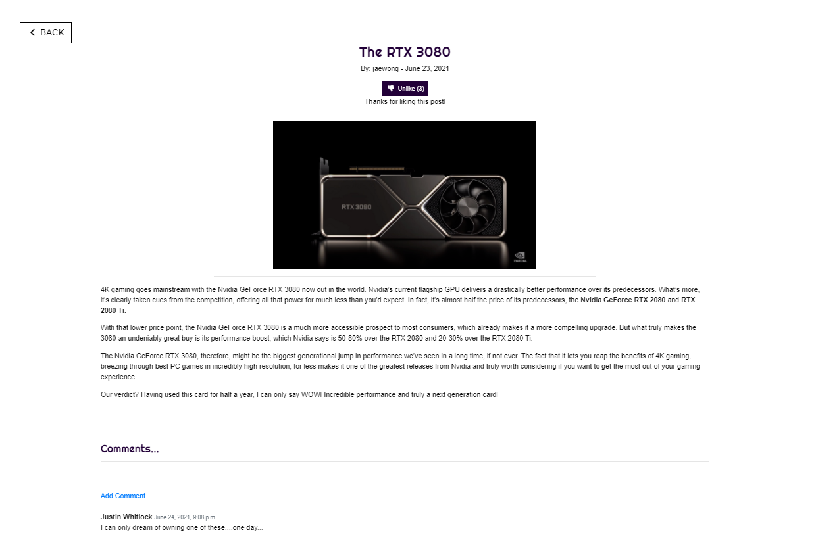

## Custom Error Pages

- For cases where errors occur such as data has been removed and no longer exists, it is possible for a user to access a page which no longer exists. I believe that custom error pages are essential and give a more friendly user experience as errors will always occur.

## Future Features

- User password reset without the use of a reset email request.
- An advanced product category feature such as selection boxes to select what categories they want on screen.
- Home page - A possible carousel to display latest products and latest blog articles.


# Technologies Used

## Languages

- [HTML5](https://en.wikipedia.org/wiki/HTML5) - Used for the overall structure of the website.
- [CSS3](https://en.wikipedia.org/wiki/Cascading_Style_Sheets) - Used for styling, colouring and layout of the site.
- [Javascript](https://www.javascript.com/) - Used to make the website interactive. This was used for the modal and sliders.
- [Python](https://www.python.org/) - Used for creating functions that handle backend processes such as adding information to the database.


## Frameworks, Libraries & Programs

- [Bootstrap](https://getbootstrap.com/) - Additional styling and adding responsiveness to the website
- [Jinja2](https://jinja.palletsprojects.com/en/2.11.x/) templating language. This is used for generating HTML templates and accessing/processing data sent from the frontend.
- [jQuery](https://jquery.com/) - A Javascript library that simplifies manipulation of of the HTML DOM.
- [Github](https://gist.github.com/derhuerst/1b15ff4652a867391f03) - GitHub is used as a storage space for the project, where it can then be pushed onto Gitpod.
- [GitPod](https://www.gitpod.io/) - Git allowed version control and also to add, commit to Git and push to GitHub.
- [Balsamiq](https://balsamiq.com/wireframes/?gclid=CjwKCAjwkdL6BRAREiwA-kiczJUq8U_iMFrVp1xv8FmLNPGDxIxjk-d9dlu_X88qo79PfI1VkZbcaxoC5-QQAvD_BwE) - The wire frame software used for the initial design of the website.
- [Google Fonts](https://fonts.google.com/) - Used to apply the font families.
- [PicResize](https://picresize.com/) - This is used to resize large images down to smaller files.
- [Responsinator](http://www.responsinator.com/?url=) - Used to test the site responsiveness on various screen resolution sizes. This is to ensure the layout is intended as designed.
- [Font Awesome](https://fontawesome.com/) - Used to apply icons such as the social media icons.
- [SQLite](https://www.sqlite.org/index.html) - The default Django database used in development.
- [PostgreSQL](https://www.postgresql.org/) - The production database through Heroku.
- [AWS S3](https://aws.amazon.com/) - The cloud service for hosting media and static files.
- [Stripe](https://stripe.com/gb) - This was used for test transactions.

## Testing

- [W3C Markup Validator](https://validator.w3.org/) - To ensure there were no syntax errors in the HTML code. The site showed only errors and warnings related to the jinja template syntax. This poses no real errors in the deployed website.
- For CSS, I used W3C CSS [W3C CSS Validator Services](https://jigsaw.w3.org/css-validator/). No errors found here.
- For Javascript, I used [JShint](https://jshint.com/) to ensure no errors in my code. - The only result showed is the '$' not being defined by JSHint. This caused no errors on the final deployed site.
- [PEP8 online](http://pep8online.com/) - The Python code was run through an online checker to ensure no errors found. The only errors showing are that lines were slightly too long. These caused no errors in production and this would be very time consuming to format.
- [cornflakes-linter(flake8)](https://marketplace.visualstudio.com/items?itemName=kevinglasson.cornflakes-linter) - For the Python code, the cornflakes-linter(flake8) extension is installed in the development environment. This gave a live validation check for the code. There are warnings about lines being too long but having spoke to other developers, the maximum 79 characters per line is rather out-dated where screens were much smaller in previous generations.
- [Google Chrome](https://www.google.co.uk/chrome/?brand=FHFK&gclid=CjwKCAjww-CGBhALEiwAQzWxOiXnVAU7qEiD9ykUo3VELjaivlvMcpmSTkKLr0vSMqvjnv7nKkY8WxoCED8QAvD_BwE&gclsrc=aw.ds) and [Firefox](https://www.mozilla.org/en-GB/firefox/new/) - These two browsers are arguably the most popular. These browsers were used to test the visuals and functionality of the website throughout the development process. Using the developer tools, the range of the resolutions were 350x650 to 2160x1440 which would cover a large variety real world screen devices
- [TEMPMAIL](https://temp-mail.org/en/) - this is used for temporary email addresses when creating/registering an account. Verification of th e account is done where the site will send an email.
- [Responsinator](http://www.responsinator.com/) - This website was used to test the site on a huge variety of screen sizes. This was to ensure the responsive design of the webapp.

Further Manual Testing - The documentation can be found [here](readme-images/TESTING-MS4.pdf).

# Deployment

The webapp was developed with [Gitpod IDE](https://www.gitpod.io/). [Git](https://gist.github.com/derhuerst/1b15ff4652a867391f03) was used for verion control and [GitHub](https://github.com/) for hosting the project's repository. 
The project is hosted on [Heroku](https://dashboard.heroku.com/apps) while [AWS S3](https://aws.amazon.com/) is hosting static files and images.

## Local Deployment

There are some requirements to run this project locally on your own IDE. These include:

- IDE of your choice. For example - [Gitpod](https://www.gitpod.io/)
- Have the following installed:
    - [Git](https://gist.github.com/derhuerst/1b15ff4652a867391f03)
    - [Python](https://www.python.org/)
    - [pip](https://pip.pypa.io/en/stable/installing/)

You will also need accounts for the following services. These are all free of charge:

- [Gmail](https://mail.google.com/mail/u/0/#inbox)
- [Stripe](https://stripe.com/gb)
- [AWS S3](https://aws.amazon.com/)

### 1.Clone this Repository

-   Once you have installed the requirements above, enter the below command into the terminal:
    - `git clone https://https://github.com/JaeWong91/Easy-PC`
- An alternate method is to go to [Easy-PC repository](https://https://github.com/JaeWong91/Easy-PC) and 'Code' button and select the 'Download ZIP' option. This way you can save the files onto your own local machine.
- For more information on this, please visit [GitHub's help pages](https://docs.github.com/en/github/creating-cloning-and-archiving-repositories/cloning-a-repository-from-github/cloning-a-repository)

### 2. Set up the environment variables

 - create an `.env.py` file in the root directory
 - add `.env.py` to the `.gitignore` file in the root directory
 - add the following environment variables to `.env`:
 ```bash
import os
os.environ["DEVELOPMENT"] = "True"
os.environ["SECRET_KEY"] = "<Your Key>"
os.environ["STRIPE_PUBLIC_KEY"] = "<Your Key>"
os.environ["STRIPE_SECRET_KEY"] = "<Your Key>"
os.environ["STRIPE_WH_SECRET"] = "<Your Key>"
 ```

- if you are working on GitPod, you can set these variables in the settings.

### 3. Install requirements from the `requirements.txt` file

 - copy and paste the below command into the terminal:
    - `pip3 install -r requirements.txt`

### 4. Migrate the models to create a database

- paste the following commands into the terminal:
    - `python3 manage.py makemigrations`
    - `python3 manage.py migrate`

### 5. Load the data fixtures in this exact order

- paste the following commands into the terminal:
    - `python3 manage.py loaddata categories`
    - `python3 manage.py loaddata products`
    - `python3 manage.py loaddata blog`

### 6. Create a Superuser (a user with admin rights)
- paste the following command into the terminal:
    - `python3 manage.py createsuperuser`

    - enter an e-mail, username and password for the superuser

### 7. Run the web app
- paste the command into the terminal:
    - `python3 manage.py runserver`

### 8. Log into the Django admin
- after running the web app, add /admin at the end of the URL and log in with the superuser credentials from the previous step

## Heroku Deployment

### 1. Create a `requirements.txt` file
- paste the following command into the terminal:
    - `pip freeze > requirements.txt`

### 2. Create a `Procfile`
- create a `Procfile` in the root directory
- add the following code into it:
    - `web: gunicorn ecosio.wsgi:application`

### 3. Push the code to GitHub
- paste the following commands into the terminal:
    - `git add .`
    - `git commit -m "<your commit note>"`
    - `git push`

### 4. Create a new app on Heroku
- create a new app (click on 'New' > 'Create new app')
- give it a unique name
- set region closest to you

### 5. Set Heroku Postgres
- go to 'Resources' tab
- search for 'Heroku Postgres'
- select the 'Hobby Dev' free plan

### 6. Set config variables in Heroku

| **Key**   | **Value**   |
| --------- | ----------- |
| AWS_ACCESS_KEY_ID | < your AWS access key ID > |
| AWS_SECRET_ACCESS_KEY | < your AWS secret access key > |
| DATABASE_URL | < your postgres database URL > |
| EMAIL_HOST_PASS | < 16-character password from Gmail > |
| EMAIL_HOST_USER | < your Gmail > |
| SECRET_KEY | < your secret key > |
| STRIPE_PUBLIC_KEY | < your stripe public key > |
| STRIPE_SECRET_KEY | < your stripe secret key > |
| STRIPE_WH_SECRET | < your stripe webhook key > |
| USE_AWS | True |

### 7. Set up new database
- in `settings.py`:
    - import dj_database_url
    - comment out `DATABASES` (temporarily, **do not commit/push this code to GitHub until instructed so**)
    - add the following code:
```bash
DATABASES = {
        'default': dj_database_url.parse("<your Postrgres database URL>")
    }
```

### 8. Migrate the models to Postgres database
- paste the following commands into the terminal:
    - `python3 manage.py makemigrations`
    - `python3 manage.py migrate`

### 9. Load the data fixtures in this exact order
- paste the following commands into the terminal:
    - `python3 manage.py loaddata categories`
    - `python3 manage.py loaddata products`
    - `python3 manage.py loaddata blog`

### 10. Create a superuser (user with admin rights)
- paste the following command into the terminal:
    - `python3 manage.py createsuperuser`
- enter an e-mail, username and password for the superuser

### 11. Correct the `settings.py` database from step 7.
- uncomment the `DATABASES`
- remove the code added in step 7.

### 12. Add the hostname of Heroku app to allowed EMAIL_HOST_USER
- in `settings.py`:
    - add the following code:
```bash
ALLOWED_HOSTS = ['<your Heroku app URL>', 'localhost]
```

### 13. Push the code to GitHub
- paste the following commands into the terminal:
    - `git add .`
    - `git commit -m "<your commit note>"`
    - `git push`

### 14. Set up automatic deployment to Heroku (**optional**)
- in Heroku go to 'Deploy' > 'Deployment method' > 'Connect to GitHub'
- search for your repository and click on it
- go to 'Automatic Deployment' > click 'Enable Automatic Deploys'

### 15. Test automatic deployment
- your code should be automatically deployed to Heroku after pushing your code

### Hosting Files with AWS

In order to host static files and images with AWS, you will need to create an [AWS account](https://aws.amazon.com/).
Additionally, you have to create:
- an AWS S3 Bucket
- a Bucket Policy
- a Group
- an Access Policy
- a User

This is a rather long process. You can find more detailed information on Amazon Storage Service [here](https://docs.aws.amazon.com/AmazonS3/latest/userguide/GetStartedWithS3.html).
When this is done, you will need to connect [Django to S3](https://django-storages.readthedocs.io/en/latest/backends/amazon-S3.html)


# E-mails through Gmail

In order for the project take advantage of Django's automatic e-mail service, you will need a Gmail account.

- go to the account settings
- go to the 'Other Google Account Settings'
- go to the 'Security' tab
- turn on 2-step verification
- go back to 'Security' tab and click on 'App passwords'
- select 'Mail' in the app dropdown
- select 'Other' in the device dropdown
- copy the 16-character password
- go to Heroku and put it under `EMAIL_HOST_PASS` config variable
- put the Gmail e-mail under the `EMAIL_HOST_USER` config var


## Credits

 - [Amazon](amazon.co.uk) - All of the products listed are taken from Amazon along with the product images.
 - For the articles, these were taken from [PC Gamer](https://www.pcgamer.com/uk/) and [Tech Reviews](https://www.techradar.com/reviews). They have excellent content for all things related to computing and gaming.
 - CodeInstitute - Many thanks to student support tutoring service. Extremely helpful where I was stuck in the project.
 - Slack - Cases where there were issues previous students encountered, this was super helpful.
 - [Codemy.com](https://www.youtube.com/channel/UCFB0dxMudkws1q8w5NJEAmw) - Youtube channel assisted with developing my Blog app. This was extremely detailed and helped greatly in the developing process.
 - My mentor Spencer Bariball. He gave me the idea to add reviews to products and extend the project with a Blog App. Extremely grateful for the review of the project.
 - Friends and family - My friends and family were kind enough to browse through the website and test the functionality.
 


